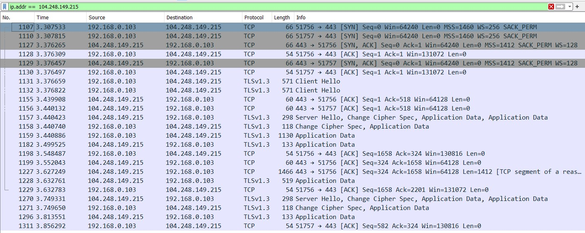

# Monolith OHL Labpro

Nama: Arsa Izdihar Islam

NIM: 13521101

## Deployment
Api ini sudah di-deploy pada [https://ohl-monolith.arsaizdihar.com](https://ohl-monolith.arsaizdihar.com) dengan api dokumen di [https://ohl-monolith.arsaizdihar.com/api](https://ohl-monolith.arsaizdihar.com/api)

## Tech stack
- Django

## How to run

1. Install docker
2. Jalankan `docker-compose -f docker-compose.dev.yml up -d --build`
3. Api akan berjalan pada port 3000. Buka http://localhost:8000 untuk melihat web.

## Design patterns

1. MVC

Model - View - Controller merupakan pattern utama pada Django monolith (fullstack). Model digunakan untuk mengakses database, view digunakan untuk menampilkan data, dan controller digunakan untuk menghandle request dari user.

2. Singleton
  
Pada Django, singleton digunakan pada bagian settings sehingga seluruh aplikasi dapat mengakses keseluruhan konfigurasi di settings. Selain itu, singleton juga digunakan untuk akses database.

3. Template method

Pattern ini digunakan pada Django untuk memungkinkan menggunakan code yang sama. Salah satu bagian yang banyak menggunakan pattern ini adalah templating HTML.

## Endpoint
- /register (GET, POST) untuk view register dan submit register form
- /login (GET, POST) untuk view login dan submit login form
- / (GET) catalog
- /barang/<id> (GET, POST) detail barang dan beli barang
- /history (GET) history pembelian

## Bonus
1. Deployment
  
Seperti yang disebut di atas, api ini sudah dideploy dengan menggunakan docker di VM DigitalOcean.

2. Lighthouse

Setiap halaman pada monolith sudah dicek dengan lighthouse dengan score full 100. Berikut hasilnya:

3. Responsive layout

Seluruh halaman yang ada sudah responsive dengan menggunakan bootstrap.

4. Dokumentasi API

Dokumentasi dapat dilihat pada bagian endpoint di atas.

5. SOLID
  
S: Pada Django, bagian-bagian concern terpisah berdasarkan beberapa apps. Masing-masing apps juga memiliki beberapa bagian yang mempunyai responsibilitynya masing-masing seperti model untuk mengakses database, view untuk mengatur tampilan/berkaitan dengan template, dan urls untuk controller.

O: View yang saya buat merupakan ekstensi dari class Django dan masing-masing view ini dapat diekstensi dengan membuat kelas baru.

L: Model-model yang dibuat dapat di-inherit dengan tetap memenuhi kontrak yang ada.

I: View yang dibuat seharusnya hanya mengimplementasi methods yang berkaitan dengan response.

D: Controller tidak bergantung pada class langsung view, melainkan pada base view dari Django

6. Wireshark

Koneksi antar kedua service sudah dicek menggunakan wireshark. Ternyata, tidak terlihat sama sekali bahwa ada pengiriman data dari sesama IP di dalam VM. Artinya, tidak mungkin untuk ada interceptor yang mengganggu komunikasi antar service. Berikut hasilnya:

7. Testing

Testing dibuat untuk setiap endpoint dengan coverage sebagai berikut  yaitu line coverage sebesar 84%.

8. Fitur tambahan

Terdapat fitur count pada bagian get all barang dan juga fitur untuk search berdasarkan nama dan kode barang.